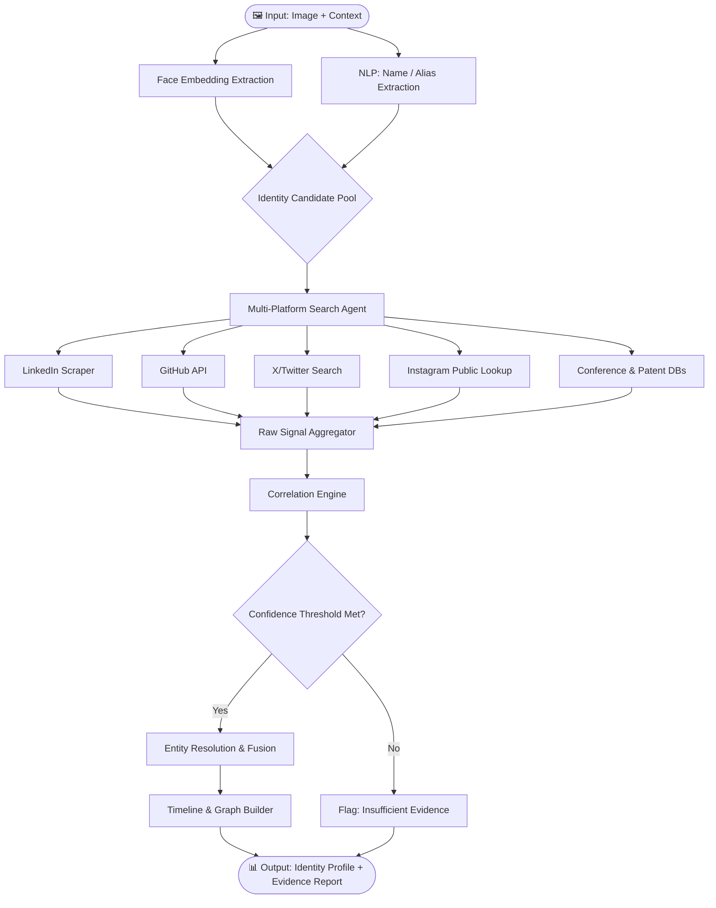

<div align="center">

# 🧠 NeuraX

### Digital Identity Intelligence System
**NeuraX Hackathon 3.0 · Domain 3 · AI in Cybersecurity**

[](https://python.org)
[]()
[]()

> **"Piece together a person's entire public digital identity — automatically, reliably, and with evidence."**

</div>

---

## 📌 Problem Understanding

A person's public digital presence is inherently **fragmented**. The same individual may appear under different names, aliases, or usernames across dozens of platforms — Instagram, X/Twitter, YouTube, LinkedIn, GitHub, personal websites, conference registries, patent databases, and more.

Manually correlating this information is:
- ❌ **Slow** — hours of cross-referencing
- ❌ **Error-prone** — common names, incomplete profiles, and imposters cause confusion
- ❌ **Unscalable** — impossible at any meaningful volume

**NeuraX** solves this by building an **AI-powered Digital Footprint Intelligence System** that takes a consented image and limited context as input and autonomously discovers, correlates, and verifies a person's entire public digital identity — with an evidence trail and confidence score on every finding.

> This is NOT a reverse-image search tool or a generic web scraper.  
> This is a **digital identity intelligence engine**.

---

## 🎯 Objectives

| # | Objective | Description |
|---|-----------|-------------|
| 1 | **Identity Matching** | Identify the most likely public identity from an image + context |
| 2 | **Profile Discovery** | Find social-media and professional profiles (Instagram, X, LinkedIn, GitHub, YouTube, etc.) |
| 3 | **Multi-Platform Correlation** | Link accounts across platforms using shared signals (photo, bio, username patterns, writing style) |
| 4 | **Entity Resolution** | Resolve aliases, name variants, and username differences to a single canonical identity |
| 5 | **Information Extraction** | Extract organizations, roles, events, projects, publications, and patents |
| 6 | **Evidence Verification** | Attach a traceable source URL and confidence score to every material claim |
| 7 | **Timeline & Graph Generation** | Construct a chronological timeline and relationship graph of the person's public activities |
| 8 | **Robustness & False-Match Handling** | Gracefully handle ambiguity, missing data, conflicting signals, and false positives |
| 9 | **Privacy-Respecting Design** | Use only consented, public, or authorized information — no private-account access or credential bypass |

---

## 🏗️ Architecture

```
┌─────────────────────────────────────────────────────────────┐
│                        INPUT LAYER                          │
│           Image (consented) + Limited Context               │
└──────────────────────┬──────────────────────────────────────┘
                       │
                       ▼
┌─────────────────────────────────────────────────────────────┐
│                  IDENTITY RESOLUTION ENGINE                 │
│  ┌─────────────────┐    ┌──────────────────────────────┐   │
│  │  Face Analysis  │    │  Name/Context NLP Processing  │   │
│  │  (Visual OSINT) │    │  (Entity extraction, aliases) │   │
│  └────────┬────────┘    └──────────────┬───────────────┘   │
│           └──────────────┬─────────────┘                   │
│                          ▼                                  │
│              Candidate Identity Pool                        │
└──────────────────────────┬──────────────────────────────────┘
                           │
                           ▼
┌─────────────────────────────────────────────────────────────┐
│                  MULTI-PLATFORM DISCOVERY                   │
│                                                             │
│   LinkedIn · GitHub · X/Twitter · Instagram · YouTube       │
│   Personal Sites · Conference Registries · Patent DBs       │
│   Company Pages · Publications · Hackathon Platforms        │
└──────────────────────────┬──────────────────────────────────┘
                           │
                           ▼
┌─────────────────────────────────────────────────────────────┐
│               CORRELATION & FUSION ENGINE                   │
│  • Cross-platform username pattern matching                 │
│  • Profile photo similarity scoring                         │
│  • Bio / writing style fingerprinting                       │
│  • Temporal signal alignment                                │
│  • Graph-based entity linking                               │
└──────────────────────────┬──────────────────────────────────┘
                           │
                           ▼
┌─────────────────────────────────────────────────────────────┐
│               EVIDENCE & CONFIDENCE LAYER                   │
│  • Source URL attached to every claim                       │
│  • Confidence score (0–100%) per finding                    │
│  • Uncertainty / conflict flagging                          │
│  • False-match rejection reasoning                          │
└──────────────────────────┬──────────────────────────────────┘
                           │
                           ▼
┌─────────────────────────────────────────────────────────────┐
│                      OUTPUT LAYER                           │
│  • Unified Identity Profile                                 │
│  • Activity Timeline                                        │
│  • Relationship / Affiliation Graph                         │
│  • Evidence Report (JSON + Human-readable)                  │
└─────────────────────────────────────────────────────────────┘
```

---

## 🔄 System Workflow



---

## 🧩 Technical Approach

### Phase 1 — Identity Resolution
- **Visual OSINT**: Face embeddings using a state-of-the-art face recognition model to generate a fingerprint from the input image
- **NLP Pipeline**: spaCy / Transformers-based NER to extract names, aliases, organizations, and locations from provided context

### Phase 2 — Multi-Platform Discovery
- **GitHub API**: Username, repositories, contributions, organizations
- **LinkedIn**: Public profile scraping (name, headline, roles, education)
- **X/Twitter**: Public timeline, bio, username variants
- **Instagram**: Public profile metadata
- **Conference & Patent DBs**: Structured search against public registries
- **Search Engine Dorking**: Targeted queries to surface hidden mentions

### Phase 3 — Correlation & Fusion
- **Graph Database (NetworkX / Neo4j)**: Model identity as a node with edges to each platform account
- **Username Pattern Matching**: Fuzzy matching + Levenshtein distance across platforms
- **Cross-Platform Signal Alignment**: Bio keywords, location, profile photo similarity, temporal overlap
- **LLM Reasoning Layer**: GPT-4 / Gemini to reason over evidence and resolve ambiguity

### Phase 4 — Evidence & Output
- Every claim → `{ claim, source_url, confidence, verification_method }`
- Conflicting signals → flagged with `conflict_reason`
- Final output: JSON report + rendered HTML timeline + relationship graph visualization

---

## 🗂️ Repository Structure

```
NeuraX/
├── README.md                  # This file
├── .agents/                   # Agent memory, rules, context
│   ├── AGENTS.md              # Agent instructions (auto-loaded)
│   ├── memory.md              # Living memory — updated each session
│   ├── rules.md               # Scope locks and behavioral rules
│   ├── context.md             # Problem statement + rubric
│   └── workflow.md            # Detailed workflow diagrams
├── src/
│   ├── identity/              # Face embedding & identity resolution
│   ├── discovery/             # Per-platform scrapers & API clients
│   ├── correlation/           # Fusion, graph, entity resolution
│   ├── evidence/              # Source attachment & confidence scoring
│   └── output/                # Timeline, graph, and report generation
├── data/
│   ├── input/                 # Test images and context files
│   └── output/                # Generated reports and graphs
├── tests/                     # Unit and integration tests
├── requirements.txt
└── main.py                    # Entry point
```

---

## 📊 Evaluation Rubric (100 Marks)

| Checkpoint | Marks | Criteria |
|------------|-------|----------|
| ✅ **CP1** | 15 | README: Problem Understanding (5) + Architecture (5) + Approach (5) |
| 🔄 **CP2** | 25 | Partial Execution: Features + Problem Relatability |
| 🎯 **CP3** | 60 | Full system: Identity matching (10) · Profile discovery (5) · Multi-platform correlation (10) · Entity resolution (5) · Info extraction (5) · Evidence verification (5) · Timeline/graph (5) · Robustness (5) · Technical implementation (5) · Privacy design (5) |

---

## ⚖️ Privacy & Responsible Design

- ✅ Uses **only consented, publicly available, or authorized** information
- ✅ No private-account access, credential bypass, or leaked data
- ✅ Findings clearly labeled with confidence and uncertainty
- ✅ False positives handled with explicit rejection reasoning
- ✅ Compliant with ethical OSINT principles

---

## 🚀 Getting Started

```bash
# Clone the repository
git clone https://github.com/Abhinavjy27/NeuraX.git
cd NeuraX

# Create virtual environment
python3 -m venv .venv
source .venv/bin/activate

# Install dependencies
pip install -r requirements.txt

# Run the system
python main.py --image data/input/sample.jpg --context "Software engineer, Bangalore"
```

---

<div align="center">

**Built for NeuraX Hackathon 3.0 · Domain 3 · AI in Cybersecurity**

</div>
