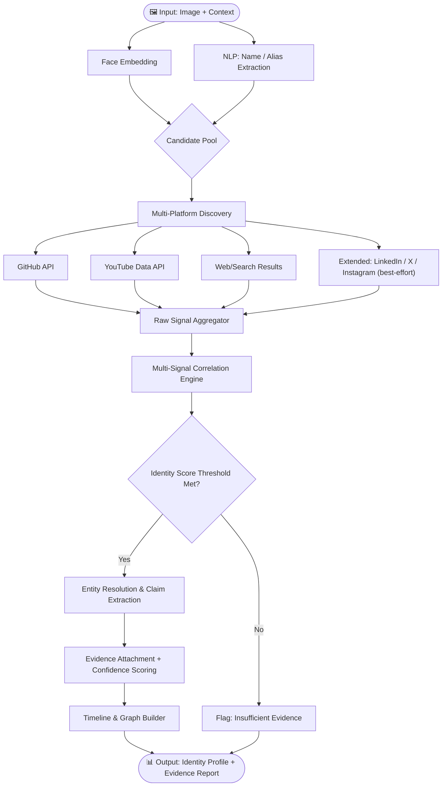

<div align="center">

# 🧠 NeuraX

### Digital Identity Intelligence System
**NeuraX Hackathon 3.0 · Domain 3 · AI in Cybersecurity**

[](https://python.org)
[]()
[]()

> **"Piece together a person's entire public digital identity — automatically, reliably, and with evidence."**

</div>

---

## 📌 Problem Understanding

A person's public digital presence is inherently **fragmented**. The same individual may appear under different names, aliases, or usernames across dozens of platforms — Instagram, X/Twitter, YouTube, LinkedIn, GitHub, personal websites, conference registries, patent databases, and more.

Manually correlating this information is:
- ❌ **Slow** — hours of cross-referencing
- ❌ **Error-prone** — common names, incomplete profiles, and imposters cause confusion
- ❌ **Unscalable** — impossible at any meaningful volume

**NeuraX** solves this by building an **AI-powered Digital Footprint Intelligence System** that takes a consented image and limited context as input and autonomously discovers, correlates, and verifies a person's entire public digital identity — with an evidence trail and confidence score on every finding.

> This is NOT a reverse-image search tool or a generic web scraper.
> This is a **digital identity intelligence engine** that resolves identity through corroborating independent public evidence, not a single signal.

---

## 🎯 Objectives

| # | Objective | Description |
|---|-----------|-------------|
| 1 | **Identity Matching** | Identify the most likely public identity from an image + context |
| 2 | **Profile Discovery** | Find social-media and professional profiles across supported platforms |
| 3 | **Multi-Platform Correlation** | Link accounts across platforms using shared signals (name, username, org, project, photo) |
| 4 | **Entity Resolution** | Resolve aliases, name variants, and username differences to a single canonical identity |
| 5 | **Information Extraction** | Extract organizations, roles, events, projects, publications, and patents |
| 6 | **Evidence Verification** | Attach a traceable source URL and confidence score to every material claim |
| 7 | **Timeline & Graph Generation** | Construct a chronological timeline and relationship graph of the person's public activities |
| 8 | **Robustness & False-Match Handling** | Gracefully handle ambiguity, missing data, conflicting signals, and false positives |
| 9 | **Privacy-Respecting Design** | Use only consented, public, or authorized information — no private-account access or credential bypass |

---

## 🌐 Platform Scope

| Tier | Platforms | Access Method |
|---|---|---|
| **Core (live demo)** | GitHub, YouTube, public web/search results, personal sites | GitHub REST API, YouTube Data API (free tier), Google Programmable Search / DuckDuckGo (free tier) |
| **Extended (architecture-ready, best-effort)** | LinkedIn, X/Twitter, Instagram, conference & patent registries | Public search-snippet lookups only — no login, no scraping behind auth walls, no paid API tiers |

We scope this explicitly because reliable, ToS-compliant access to LinkedIn/X/Instagram without paid APIs is limited — the architecture supports adding them, but the live system is built and demoed on the Core tier first.

---

## 🏗️ Architecture

```
┌─────────────────────────────────────────────────────────────┐
│                        INPUT LAYER                          │
│           Image (consented) + Limited Context               │
└──────────────────────┬──────────────────────────────────────┘
                       │
                       ▼
┌─────────────────────────────────────────────────────────────┐
│                  CANDIDATE GENERATION                       │
│  ┌─────────────────┐    ┌──────────────────────────────┐   │
│  │  Face Embedding  │    │  Name/Context NLP Processing  │   │
│  │  (one signal)    │    │  (entity + alias extraction)  │   │
│  └────────┬────────┘    └──────────────┬───────────────┘   │
│           └──────────────┬─────────────┘                   │
│                          ▼                                  │
│              Candidate Identity Pool                        │
└──────────────────────────┬──────────────────────────────────┘
                           │
                           ▼
┌─────────────────────────────────────────────────────────────┐
│                  MULTI-PLATFORM DISCOVERY                   │
│         GitHub · YouTube · Public Web/Search Results         │
│      (Extended: LinkedIn · X/Twitter · Instagram · Patents)  │
└──────────────────────────┬──────────────────────────────────┘
                           │
                           ▼
┌─────────────────────────────────────────────────────────────┐
│               CORRELATION & FUSION ENGINE                   │
│  Multi-signal identity scoring — no single signal decides:   │
│  • Name/alias match     • Organization overlap               │
│  • Username match       • Project/event overlap               │
│  • Image similarity     • Bio/context similarity               │
│  • Source corroboration bonus, contradiction penalty          │
└──────────────────────────┬──────────────────────────────────┘
                           │
                           ▼
┌─────────────────────────────────────────────────────────────┐
│               EVIDENCE & CONFIDENCE LAYER                   │
│  • Every claim = {claim, evidence[], confidence}             │
│  • Uncertainty / conflict flagging, not silent merging        │
│  • False-match rejection reasoning                            │
└──────────────────────────┬──────────────────────────────────┘
                           │
                           ▼
┌─────────────────────────────────────────────────────────────┐
│                      OUTPUT LAYER                            │
│  • Unified Identity Profile   • Activity Timeline             │
│  • Relationship/Affiliation Graph  • Evidence Report (JSON)   │
└─────────────────────────────────────────────────────────────┘
```

---

## 🔄 System Workflow



---

## 🧬 Data Model

Every finding is built from five objects — this is the contract all backend and frontend work is built against:

```json
// Person
{ "id": "person_001", "canonical_name": "...", "aliases": [], "usernames": [], "confidence": 0.0 }

// Profile
{ "platform": "github", "username": "...", "url": "...", "confidence": 0.0 }

// Entity
{ "type": "organization | event | project | publication | patent", "name": "..." }

// Claim
{ "id": "claim_123", "subject": "person_001", "predicate": "works_at", "object": "XYZ Technologies" }

// Evidence
{ "claim_id": "claim_123", "source_url": "...", "excerpt": "...", "source_type": "github", "confidence": 0.0 }
```

A claim is never presented without at least one `Evidence` object. Claims with only one weak source are visibly marked low-confidence rather than hidden or auto-merged.

### Identity Scoring

No single signal decides a match. Each candidate accumulates a score:

```
identity_score =
    name_score + username_score + image_score
  + organization_overlap + project_overlap + context_score
  + source_corroboration_bonus
  - contradiction_penalty
```

Output is shown to the user as **signal strength (name/username/org/project/image/corroboration)** plus any flagged conflicts — not a single opaque percentage.

---

## 🧩 Technical Approach

### Phase 1 — Candidate Generation
- **Visual signal**: face embedding (`face_recognition` / InsightFace, run locally) from the consented image — used later for *verification scoring*, not as a search mechanism
- **NLP pipeline**: spaCy/Transformers NER on the given context to extract name variants, organizations, locations
- **Username generator**: rule-based permutations (firstlast, first.last, initials, etc.)

### Phase 2 — Multi-Platform Discovery
- **GitHub API**: profile, repositories, contributions, organizations
- **YouTube Data API**: channel, videos, descriptions
- **Web/Search**: Google Programmable Search (free tier) / DuckDuckGo results, public page fetching
- **Extended (best-effort)**: LinkedIn/X/Instagram/patent-registry public search snippets where accessible without login or paid tiers
- **LLM budget note**: ~$5 GPT-4o-mini credit is earmarked for entity extraction and disambiguation calls; batch calls per candidate rather than per-snippet to conserve it, and fall back to a free-tier LLM if it runs out mid-hackathon

### Phase 3 — Correlation & Fusion
- **Entity resolution**: fuzzy matching (`rapidfuzz`) across names/usernames/bios
- **Multi-signal scoring**: identity_score formula above, computed per candidate
- **Graph modeling**: `networkx` — identity as a node, edges to platforms/orgs/projects/events
- **LLM reasoning layer**: GPT-4o-mini (primary — budget-metered, ~$5 credit) extracts structured Claims from unstructured bios/posts and helps resolve ambiguous cases; Groq/Gemini free tier as fallback if credit runs low

### Phase 4 — Evidence & Output
- Every claim → `{ claim, evidence[], confidence }` per the data model above
- Conflicting signals → flagged with an explicit `conflict_reason`, never silently resolved
- Final output: JSON report + rendered HTML timeline + relationship graph visualization

---

## 🗂️ Repository Structure

```
NeuraX/
├── README.md
├── .agents/
│   ├── AGENTS.md
│   ├── memory.md
│   ├── rules.md
│   ├── context.md
│   └── workflow.md
├── src/
│   ├── identity/               # Face embedding & candidate generation      (Backend 1)
│   ├── discovery/               # Per-platform scrapers & API clients        (Backend 1)
│   ├── correlation/             # Multi-signal scoring & entity resolution   (Backend 2)
│   ├── evidence/                 # Claim + evidence generation, LLM layer    (Backend 2)
│   └── output/                   # Timeline/graph data builders             (Backend 2)
├── dashboard/
│   ├── core/                     # App shell, API client, candidate/evidence views (Frontend 1)
│   └── visualize/                # Timeline + relationship graph, report/export     (Frontend 2)
├── data/
│   ├── input/
│   ├── fixtures/                 # Mock JSON matching the API contract, for frontend to build against from hour 0
│   └── output/
├── tests/
├── requirements.txt
└── main.py
```

---

## 👥 Team & Task Split

**2 Backend · 2 Frontend.** The API contract below is agreed by all four people in the first 30 minutes, before anyone codes independently — this is what prevents integration issues later. Frontend builds against `data/fixtures/*.json` matching this contract from hour 0, so it is never blocked waiting on backend.

| Endpoint | Returns |
|---|---|
| `POST /api/analyze` | `{ job_id }` — kicks off discovery for an image + context |
| `GET /api/candidates/{job_id}` | `CandidateProfile[]` with per-signal scores |
| `GET /api/identity/{person_id}` | Resolved `Person` (canonical name, aliases, usernames, confidence) |
| `GET /api/claims/{person_id}` | `Claim[]`, each with nested `Evidence[]` |
| `GET /api/timeline/{person_id}` | Chronological event list |
| `GET /api/graph/{person_id}` | Graph `{ nodes[], edges[] }` |

### Backend — Person 1: Discovery & Candidate Signals
**Owns:** `src/identity/`, `src/discovery/`
- Username/candidate generator (name → handle variants)
- GitHub API client, YouTube Data API client
- Web/search discovery + public page fetcher (Google Programmable Search / DuckDuckGo)
- Face embedding extraction + similarity function
- NLP context parsing (spaCy NER) for names/orgs/locations
- **Ships:** `CandidateProfile[]` matching the contract, served at `/api/candidates/{job_id}`

### Backend — Person 2: Correlation, Evidence & Reasoning
**Owns:** `src/correlation/`, `src/evidence/`, `src/output/`
- Entity resolution (fuzzy matching, alias/username merging)
- Multi-signal scoring engine — owns the actual weights in the `identity_score` formula
- LLM extraction layer → structured `Claim` objects (roles, orgs, events, projects, patents)
- Evidence attachment — every `Claim` gets `Evidence[]`
- Timeline + graph data builder (data only, not rendering)
- **Ships:** `/api/identity`, `/api/claims`, `/api/timeline`, `/api/graph`

### Frontend — Person 1: Core Dashboard & API Integration
**Owns:** `dashboard/core/`
- API client / data-fetching layer, built against `data/fixtures/` from hour 0
- Identity overview view — canonical name, confidence badge, alias list
- Evidence view — click a claim, see source list/excerpts/confidence ("why do we believe this")
- App state management and routing

### Frontend — Person 2: Timeline, Graph & Demo
**Owns:** `dashboard/visualize/`
- Timeline visualization of extracted events/roles
- Relationship graph visualization (`networkx` data → vis.js/D3), interactive on org/project/event nodes
- Report/export view (human-readable + JSON download)
- Demo script and pitch narrative for judges

---

## 📊 Evaluation Rubric (100 Marks)

| Checkpoint | Marks | Criteria |
|------------|-------|----------|
| ✅ **CP1** | 15 | README: Problem Understanding (5) + Architecture (5) + Approach (5) |
| 🔄 **CP2** | 25 | Partial Execution: Features + Problem Relatability |
| 🎯 **CP3** | 60 | Full system: Identity matching (10) · Profile discovery (5) · Multi-platform correlation (10) · Entity resolution (5) · Info extraction (5) · Evidence verification (5) · Timeline/graph (5) · Robustness (5) · Technical implementation (5) · Privacy design (5) |

---

## ⚖️ Privacy & Responsible Design

- ✅ Uses **only consented, publicly available, or authorized** information
- ✅ No private-account access, credential bypass, or leaked data
- ✅ Findings clearly labeled with confidence and uncertainty
- ✅ Conflicting or low-confidence claims are flagged, never silently merged
- ✅ Compliant with ethical OSINT principles

---

## 🚀 Getting Started

```bash
git clone https://github.com/Abhinavjy27/NeuraX.git
cd NeuraX

python3 -m venv .venv
source .venv/bin/activate

pip install -r requirements.txt

python main.py --image data/input/sample.jpg --context "Software engineer, Bangalore"
```

---

<div align="center">

**Built for NeuraX Hackathon 3.0 · Domain 3 · AI in Cybersecurity**

</div>
