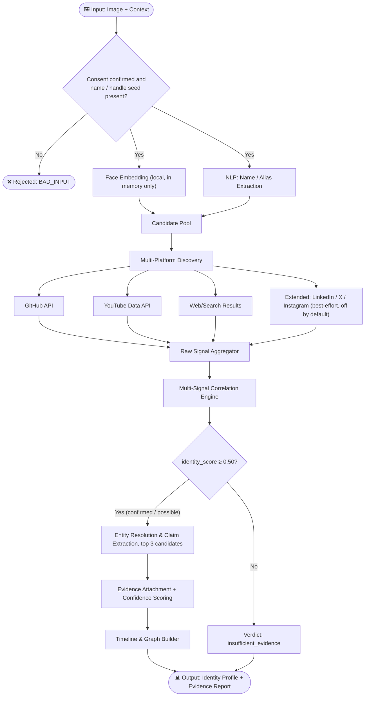

<div align="center">

# 🧠 NeuraX

### Digital Identity Intelligence System
**NeuraX Hackathon 3.0 · Domain 3 · AI in Cybersecurity**

[](https://highland-opt-fee-critical.trycloudflare.com/investigation)
[](https://python.org)
[]()
[]()

> **"Piece together a person's entire public digital identity — automatically, reliably, and with evidence."**

### 🌐 [Live Deployment & Investigation Console](https://highland-opt-fee-critical.trycloudflare.com/investigation)
**Try NeuraX Live in Browser**: [https://highland-opt-fee-critical.trycloudflare.com/investigation](https://highland-opt-fee-critical.trycloudflare.com/investigation)

</div>

---

> [!IMPORTANT]
> ### 🚀 Live Interactive Demo
> **NeuraX is currently deployed and live online!**  
> Access the Trinetra Investigation Console directly at:  
> 👉 **[https://highland-opt-fee-critical.trycloudflare.com/investigation](https://highland-opt-fee-critical.trycloudflare.com/investigation)**  
> 
> *Key features available in the live console:*
> - 🔍 **Multi-Source OSINT Discovery**: Real-time cross-platform scraping (LinkedIn, Scholar, GitHub, Instagram, News).
> - 👤 **Facial Cross-Verification**: DeepFace facial match confirmation against probe images.
> - 🕸️ **Interactive Knowledge Graph**: 2D topology with 3D Earth visualization.
> - 💬 **GraphRAG Chatbot**: Interrogate discovered footprints with a retrieval-augmented AI analyst.

---


## 📌 Problem Understanding

A person's public digital presence is inherently **fragmented**. The same individual may appear under different names, aliases, or usernames across dozens of platforms — Instagram, X/Twitter, YouTube, LinkedIn, GitHub, personal websites, conference registries, patent databases, and more.

Manually correlating this information is:
- ❌ **Slow** — hours of cross-referencing
- ❌ **Error-prone** — common names, incomplete profiles, and imposters cause confusion
- ❌ **Unscalable** — impossible at any meaningful volume

**NeuraX** solves this by building an **AI-powered Digital Footprint Intelligence System** that takes a consented image and limited context (at minimum a name, username, or profile URL) and autonomously discovers, correlates, and verifies a person's public digital identity — with an evidence trail and confidence score on every finding.

> This is NOT a reverse-image search tool or a generic web scraper.
> This is a **digital identity intelligence engine** that resolves identity through corroborating independent public evidence, not a single signal.
> The face is a **verification signal, never a search key**: NeuraX does not search the web by face. The context seeds the candidates; the image helps confirm or reject them.

---

## 🎯 Objectives

| # | Objective | Description |
|---|-----------|-------------|
| 1 | **Identity Matching** | Rank the most likely public identities among candidates seeded by the context, using the image as one verifying signal |
| 2 | **Profile Discovery** | Find social-media and professional profiles across supported platforms |
| 3 | **Multi-Platform Correlation** | Link accounts across platforms using shared signals (name, username, org, project, photo) |
| 4 | **Entity Resolution** | Resolve aliases, name variants, and username differences to a single canonical identity |
| 5 | **Information Extraction** | Extract organizations, roles, events, projects, publications, and patents |
| 6 | **Evidence Verification** | Attach a traceable source URL and confidence score to every material claim |
| 7 | **Timeline & Graph Generation** | Construct a chronological timeline and relationship graph of the person's public activities |
| 8 | **Robustness & False-Match Handling** | Gracefully handle ambiguity, missing data, conflicting signals, and false positives |
| 9 | **Privacy-Respecting Design** | Use only consented, public, or authorized information — no private-account access or credential bypass |

---

## 🌐 Platform Scope

| Tier | Platforms | Access Method |
|---|---|---|
| **Core (live demo)** | GitHub, YouTube, public web/search results, personal sites | GitHub REST API, YouTube Data API (free tier), Google Programmable Search API (primary) with DuckDuckGo HTML as a best-effort fallback |
| **Extended (architecture-ready, best-effort, off by default)** | LinkedIn, X/Twitter, Instagram, conference & patent registries | Public search-snippet lookups via Playwright (headless browser) only — no login, no scraping behind auth walls, no paid API tiers |

We scope this explicitly because reliable access to LinkedIn/X/Instagram without paid APIs is limited and may conflict with platform terms. The Core tier uses official free-tier APIs wherever one exists. Extended-tier lookups sit behind a feature flag, are rate-limited, respect `robots.txt`, and are **skipped rather than worked around** when blocked (no login, no CAPTCHA or rate-limit bypass). The live system is built and demoed on the Core tier first.

---

## 🏗️ Architecture

```
┌─────────────────────────────────────────────────────────────┐
│                        INPUT LAYER                          │
│           Image (consented) + Context (name / handle seed)  │
└──────────────────────┬──────────────────────────────────────┘
                       │
                       ▼
┌─────────────────────────────────────────────────────────────┐
│                  CANDIDATE GENERATION                       │
│  ┌─────────────────┐    ┌──────────────────────────────┐   │
│  │  Face Embedding  │    │  Name/Context NLP Processing  │   │
│  │  (one signal)    │    │  (entity + alias extraction)  │   │
│  └────────┬────────┘    └──────────────┬───────────────┘   │
│           └──────────────┬─────────────┘                   │
│                          ▼                                  │
│              Candidate Identity Pool                        │
└──────────────────────────┬──────────────────────────────────┘
                           │
                           ▼
┌─────────────────────────────────────────────────────────────┐
│                  MULTI-PLATFORM DISCOVERY                   │
│         GitHub · YouTube · Public Web/Search Results         │
│      (Extended: LinkedIn · X/Twitter · Instagram · Patents)  │
└──────────────────────────┬──────────────────────────────────┘
                           │
                           ▼
┌─────────────────────────────────────────────────────────────┐
│               CORRELATION & FUSION ENGINE                   │
│  Multi-signal identity scoring — no single signal decides:   │
│  • Name/alias match     • Organization overlap               │
│  • Username match       • Project/event overlap               │
│  • Image similarity     • Bio/context similarity               │
│  • Source corroboration bonus, contradiction penalty          │
└──────────────────────────┬──────────────────────────────────┘
                           │
                           ▼
┌─────────────────────────────────────────────────────────────┐
│               EVIDENCE & CONFIDENCE LAYER                   │
│  • Every claim = {claim, evidence[], confidence}             │
│  • Uncertainty / conflict flagging, not silent merging        │
│  • False-match rejection reasoning                            │
└──────────────────────────┬──────────────────────────────────┘
                           │
                           ▼
┌─────────────────────────────────────────────────────────────┐
│                      OUTPUT LAYER                            │
│  • Unified Identity Profile   • Activity Timeline             │
│  • Relationship/Affiliation Graph  • Evidence Report (JSON)   │
└─────────────────────────────────────────────────────────────┘
```

---

## 🔄 System Workflow



---

## 🧬 Data Model

Every finding is built from these objects. Field names are identical in this data model, in `data/fixtures/`, and in every API response — this is the contract all backend and frontend work is built against.

```jsonc
// Person — person_id is the only identity handle the frontend passes between endpoints
{ "person_id": "person_001", "canonical_name": "...", "aliases": [], "usernames": [], "confidence": 0.0, "profiles": [] }

// Profile
{ "platform": "github", "username": "...", "url": "...", "confidence": 0.0 }

// Entity — entity_id doubles as the node id in the graph
{ "entity_id": "org_xyz", "type": "organization | event | project | publication | patent", "name": "..." }

// Claim
{ "claim_id": "claim_123", "subject": "person_001", "predicate": "works_at", "object": "XYZ Technologies",
  "object_entity_id": "org_xyz", "confidence": 0.0, "conflict_reason": null, "evidence": [] }

// Evidence
{ "claim_id": "claim_123", "source_url": "...", "excerpt": "...", "source_type": "github", "confidence": 0.0 }

// CandidateProfile — one ranked identity hypothesis, returned by /api/candidates
{ "person_id": "person_001", "canonical_name_guess": "...", "verdict": "confirmed | possible | insufficient_evidence",
  "scores": { }, "profiles_found": [] }
```

- `predicate` comes from a fixed vocabulary (`works_at`, `studied_at`, `member_of`, `contributed_to`, `authored`, `presented_at`, `holds_patent`, `located_in`) so LLM output can be validated before it is accepted.
- A claim is never presented without at least one `Evidence` object. A claim backed by a single weak source (confidence < 0.5) is visibly marked low-confidence rather than hidden or auto-merged.
- `Person.confidence` is the `identity_score` of the chosen candidate. Profile-level and claim-level confidences are separate, source-based values.

### Identity Scoring

No single signal decides a match. Each candidate gets seven signals, each scored in `[0, 1]` (or `null` if unavailable), plus a contradiction penalty:

```
identity_score = clamp( Σ (wᵢ · sᵢ)  −  w_penalty · contradiction_penalty , 0, 1 )
```

| Signal | Default weight |
|---|---|
| `name_score` | 0.20 |
| `image_score` | 0.20 |
| `organization_overlap` | 0.15 |
| `source_corroboration` | 0.15 |
| `username_score` | 0.10 |
| `project_overlap` | 0.10 |
| `context_score` | 0.10 |
| **Positive weights total** | **1.00** |
| `contradiction_penalty` (subtracted) | 0.50 |

Weights are defaults owned by Backend Person 2 and are tunable against the evaluation set below. Rules:

- **Missing signals are dropped, not zeroed.** If a candidate has no usable photo or no detectable face, `image_score` is `null` and the remaining weights are renormalized. Because that inflates scores on thin evidence, the verdict gate below also requires independent corroboration.
- **No single signal can decide.** Every weight is ≤ 0.20, so no signal alone can reach the 0.50 floor.
- `contradiction_penalty` rises when sources disagree on facts such as employer or location.

| Verdict | Condition |
|---|---|
| **confirmed** | `identity_score ≥ 0.75`, at least 2 independent source types agree, and at least 2 non-image signals ≥ 0.5 |
| **possible** | `0.50 ≤ identity_score < 0.75`, or ≥ 0.75 but failing the corroboration gate — shown, flagged for human review |
| **insufficient_evidence** | `identity_score < 0.50` — listed with its signal breakdown, no claims extracted |

The UI shows the **per-signal breakdown and any flagged conflicts**; the composite `identity_score` is a summary badge and is never displayed on its own.

---

## 🧩 Technical Approach

### Phase 1 — Candidate Generation
- **Input gate**: the request must carry `consent_confirmed=true` and a context containing at least one seed (name, username, or profile URL). Otherwise it is rejected with `BAD_INPUT` — NeuraX never falls back to face-based search.
- **NLP pipeline**: spaCy/Transformers NER on the given context to extract name variants, organizations, locations
- **Username generator**: rule-based permutations (firstlast, first.last, initials, etc.)
- **Visual signal**: face embedding (`face_recognition` / InsightFace, run locally) from the consented image. It is compared against faces in each candidate's public photos (avatars, photos on their pages) to produce `image_score` — *verification scoring*, not a search mechanism. The embedding lives in memory for the job and is never stored or sent to any third party.

### Phase 2 — Multi-Platform Discovery
- **GitHub API**: profile, repositories, contributions, organizations
- **YouTube Data API**: channel, videos, descriptions
- **Web/Search**: Google Programmable Search (free tier, primary) / DuckDuckGo HTML (best-effort fallback) for URLs, then Playwright headless-browses each result page to pull the actual public content (JS-rendered pages don't return usable HTML on a plain request)
- **Extended (best-effort, feature-flagged)**: LinkedIn/X/Instagram/patent-registry public search snippets, fetched via Playwright where accessible without login or paid tiers
- **LLM budget note**: ~$5 GPT-4o-mini credit is earmarked for entity extraction and disambiguation calls. Full claim extraction runs only for the **top 3** candidates with verdict `confirmed` or `possible`, batched per candidate rather than per snippet, with a free-tier LLM fallback if the credit runs out mid-hackathon. Only public text is sent to LLMs — never images or embeddings.

### Phase 3 — Correlation & Fusion
- **Entity resolution**: fuzzy matching (`rapidfuzz`) across names/usernames/bios
- **Multi-signal scoring**: identity_score formula above, computed per candidate
- **Graph modeling**: `networkx` — identity as a node, edges to platforms/orgs/projects/events
- **LLM reasoning layer**: GPT-4o-mini (primary — budget-metered, ~$5 credit) extracts structured Claims from unstructured bios/posts and helps resolve ambiguous cases; Groq/Gemini free tier as fallback if credit runs low

### Phase 4 — Evidence & Output
- Every claim → `{ claim, evidence[], confidence }` per the data model above
- Conflicting signals → flagged with an explicit `conflict_reason`, never silently resolved
- Final output: JSON report + rendered HTML timeline + relationship graph visualization

### Robustness Behaviour

| Situation | What NeuraX does |
|---|---|
| Common name / namesakes | Each namesake is its own candidate. Sharing only a name scores below 0.50 and is reported as `insufficient_evidence` with the signals that failed |
| No usable photo or no face detected | `image_score = null`, weights renormalized; cannot reach `confirmed` without 2 independent source types |
| Conflicting facts (employer, location) | `contradiction_penalty` rises; the claim keeps a `conflict_reason` and is rendered flagged |
| Imposter or clone account | Copied name and photo but no shared orgs, projects, or cross-links → low corroboration, so at most `possible` |
| Source blocked, rate-limited, or down | That source is skipped and noted in the evidence report; other sources continue |
| LLM credit exhausted or LLM error | Switch to the free-tier fallback; if none is available, return candidates and scores without extracted claims and say so |

---

## 🛠️ Tech Stack

| Technology | Category | Role in NeuraX |
|---|---|---|
| **Python 3.11+** | Core language | Powers all backend logic — discovery, correlation, evidence, scoring |
| **FastAPI** | Backend framework | Serves the six `/api/*` routes; async support lets it call GitHub/YouTube/search APIs concurrently instead of sequentially |
| **Uvicorn** | ASGI server | Runs the FastAPI app locally and for the demo |
| **`face_recognition` (dlib)** or **InsightFace** | Face embedding | Turns the consented input photo into a transient numeric embedding used for candidate-photo similarity — one signal among several, not a search mechanism |
| **spaCy** / **Hugging Face Transformers** | NLP / NER | Extracts names, aliases, organizations, and locations from the free-text context and from scraped bios/posts |
| **`rapidfuzz`** | Fuzzy string matching | Matches name/username variants across platforms during entity resolution (e.g. `"J. Doe"` ↔ `"johndoe123"`) |
| **`networkx`** | Graph modeling | Builds the in-memory person ↔ organization ↔ project ↔ event graph before it's serialized for the frontend |
| **GPT-4o-mini (OpenAI API)** | LLM — primary | Extracts structured `Claim` objects from unstructured bios/posts; helps disambiguate conflicting candidates; budgeted against the ~$5 credit |
| **Groq / Google Gemini (free tier)** | LLM — fallback | Backup extraction/reasoning if the GPT-4o-mini credit runs out mid-hackathon |
| **GitHub REST API** | Discovery source | Pulls profile, repos, organizations, and contribution data — free, generous rate limits, core platform |
| **YouTube Data API v3** | Discovery source | Pulls channel and video metadata — free quota, core platform |
| **Google Programmable Search API** (primary) / **DuckDuckGo HTML** (best-effort fallback) | Discovery source | General web search seeded by name + context, free tier, core platform |
| **Playwright (Python)** | Web scraping — browser automation | Headless-browser fetching of public pages that render via JavaScript (search result pages, public profile pages, personal sites) — where a plain HTTP request would return an empty shell |
| **`BeautifulSoup`** | HTML parsing | Parses the HTML Playwright returns to extract text, links, and metadata for the discovery/extraction pipeline |
| **React (Vite)** | Frontend | Dashboard UI — component-based views for candidates, identity, evidence, timeline, and graph, all driven by the `/api/*` contract |
| **`vis-network` / D3.js** (via a React wrapper, or a thin custom component) | Graph & timeline visualization | Renders the relationship graph (nodes/edges) and the chronological timeline inside React components |
| **`axios`** or the native `fetch` API | API client | Talks to the six `/api/*` endpoints from both frontend views |
| **JSON files** (`data/fixtures/`, `data/output/`) | Data storage | No database needed at hackathon scale — fixture files double as the exact frontend/backend contract from hour 0 |
| **`python-dotenv`** | Configuration | Keeps GitHub/YouTube/OpenAI API keys out of source, loaded from a local `.env` |
| **Git / GitHub** | Version control | Team collaboration and checkpoint submissions |

---

## 🗂️ Repository Structure

```
NeuraX/
├── README.md
├── .env.example                  # API-key template; the real .env is git-ignored
├── .gitignore                    # ignores .env, data/input/, data/output/
├── .agents/
│   ├── AGENTS.md
│   ├── memory.md
│   ├── rules.md
│   ├── context.md
│   └── workflow.md
├── src/
│   ├── identity/               # Face embedding & candidate generation      (Backend 1)
│   ├── discovery/               # Per-platform scrapers & API clients        (Backend 1)
│   ├── correlation/             # Multi-signal scoring & entity resolution   (Backend 2)
│   ├── evidence/                 # Claim + evidence generation, LLM layer    (Backend 2)
│   └── output/                   # Timeline/graph data builders             (Backend 2)
├── dashboard/                     # Vite + React app
│   ├── src/
│   │   ├── core/                  # App shell, API client, candidate/evidence views (Frontend 1)
│   │   ├── visualize/              # Timeline + relationship graph, report/export     (Frontend 2)
│   │   └── App.jsx
│   ├── package.json
│   └── vite.config.js
├── data/
│   ├── input/                    # consented images — git-ignored, never committed
│   ├── fixtures/                 # Mock JSON matching the API contract, for frontend to build against from hour 0
│   ├── eval/                     # labeled evaluation set (synthetic personas committed; real volunteers' data stays local)
│   └── output/                   # job results — git-ignored, purged after the retention window
├── tests/
│   └── eval/                     # evaluation harness: metrics + ablations
├── requirements.txt
└── main.py
```

---

## 🔌 API Contract

| Endpoint | Returns |
|---|---|
| `POST /api/analyze` | `{ job_id }` — kicks off discovery for an image + context |
| `GET /api/stream/{job_id}` | Live SSE telemetry stream of real-time discovery events |
| `GET /api/candidates/{job_id}` | `CandidateProfile[]` with per-signal scores and a verdict |
| `GET /api/identity/{person_id}` | Resolved `Person` (canonical name, aliases, usernames, confidence, profiles) |
| `GET /api/claims/{person_id}` | `Claim[]`, each with nested `Evidence[]` |
| `GET /api/timeline/{person_id}` | Chronological event list |
| `GET /api/graph/{person_id}` | Graph `{ nodes[], edges[] }` |
| `GET /api/report/{person_id}` | Printable HTML Intelligence Dossier & report |
| `POST /api/chat/{person_id}` | 3-Layer GraphRAG interactive analyst chat agent |

### API Specification — Inputs & Outputs

All responses are `application/json` unless noted. Errors always return:
```json
{ "error": "human-readable message", "code": "NOT_FOUND | BAD_INPUT | PROCESSING | FAILED" }
```

| HTTP | `code` | When |
|---|---|---|
| 400 | `BAD_INPUT` | Missing/invalid image, no seed (name, username, or profile URL) in `context`, or `consent_confirmed` is not `true` |
| 404 | `NOT_FOUND` | Unknown `job_id` or `person_id` |
| 202 | `PROCESSING` | Any per-person endpoint called before its job is `complete` |
| 500 | `FAILED` | Pipeline error (the job `status` becomes `failed`) |

Once a job is `complete`, `identity`, `claims`, `timeline`, and `graph` are available for every `person_id` returned in that job's candidates whose verdict is `confirmed` or `possible` (at most 3). Candidates with verdict `insufficient_evidence` are listed with their scores but have no per-person data.

---

#### `POST /api/analyze`
Kicks off the pipeline for one consented image + context. One subject per job; there is no batch mode.

**Input** — `multipart/form-data`:
| Field | Type | Required | Notes |
|---|---|---|---|
| `image` | file (jpg/png) | ✅ | the consented photo |
| `context` | string | ✅ | free text organizers give; must contain at least one seed: a name, username, or profile URL |
| `consent_confirmed` | boolean | ✅ | must be `true`; requests without it are rejected with `BAD_INPUT` |

Call it like:
```bash
curl -X POST http://localhost:8000/api/analyze \
  -F "image=@sample.jpg" \
  -F "context=Software engineer, Bangalore, name John Doe" \
  -F "consent_confirmed=true"
```

**Output** — `200 OK`:
```json
{ "job_id": "abc123", "status": "processing" }
```

---

#### `GET /api/candidates/{job_id}`
Poll this until `status` is `"complete"` (or `"failed"`).

**Input:** path param `job_id` (string, from `/analyze`)

**Output:** `candidates` is empty while `status` is `processing`.
```json
{
  "job_id": "abc123",
  "status": "processing | complete | failed",
  "candidates": [
    {
      "person_id": "person_001",
      "canonical_name_guess": "John Doe",
      "verdict": "confirmed | possible | insufficient_evidence",
      "scores": {
        "name_score": 0.9,
        "username_score": 0.8,
        "image_score": 0.85,
        "organization_overlap": 0.9,
        "project_overlap": 0.7,
        "context_score": 0.8,
        "source_corroboration": 0.9,
        "contradiction_penalty": 0.0,
        "identity_score": 0.85
      },
      "profiles_found": [
        { "platform": "github", "username": "johndoe", "url": "https://github.com/johndoe" }
      ]
    }
  ]
}
```
Any signal may be `null` (e.g. `image_score` when no face was detected); see the scoring rules above. Candidates are sorted by `identity_score`, descending. Frontend picks the top-scoring (or user-selected) candidate and passes its `person_id` to the endpoints below.

---

#### `GET /api/identity/{person_id}`
**Input:** path param `person_id` (string, from a candidate)

**Output:**
```json
{
  "person_id": "person_001",
  "canonical_name": "John Doe",
  "aliases": ["J. Doe", "Johnny Doe"],
  "usernames": ["johndoe", "jdoe123"],
  "confidence": 0.85,
  "profiles": [
    { "platform": "github", "username": "johndoe", "url": "https://github.com/johndoe", "confidence": 0.94 }
  ]
}
```

---

#### `GET /api/claims/{person_id}`
**Input:** path param `person_id`

**Output:** array of `Claim`, each with nested `Evidence[]`:
```json
[
  {
    "claim_id": "claim_123",
    "subject": "person_001",
    "predicate": "works_at",
    "object": "XYZ Technologies",
    "object_entity_id": "org_xyz",
    "confidence": 0.91,
    "conflict_reason": null,
    "evidence": [
      {
        "source_url": "https://github.com/johndoe",
        "excerpt": "Software Engineer at XYZ Technologies",
        "source_type": "github",
        "confidence": 0.92
      }
    ]
  },
  {
    "claim_id": "claim_124",
    "subject": "person_001",
    "predicate": "located_in",
    "object": "Pune",
    "object_entity_id": null,
    "confidence": 0.48,
    "conflict_reason": "location mismatch across sources",
    "evidence": [
      {
        "source_url": "https://example.com/about",
        "excerpt": "Based in Pune",
        "source_type": "web",
        "confidence": 0.5
      }
    ]
  }
]
```
A claim with `conflict_reason` set is rendered flagged, not hidden.

---

#### `GET /api/timeline/{person_id}`
**Input:** path param `person_id`

**Output:** events sorted chronologically, each traceable back to a claim. `date` is `YYYY`, `YYYY-MM`, or `YYYY-MM-DD`; events with no known date have `date: null`, sort last, and render as "Undated".
```json
[
  {
    "date": "2023-05",
    "event": "Joined XYZ Technologies as Software Engineer",
    "claim_id": "claim_123",
    "confidence": 0.91
  }
]
```

---

#### `GET /api/graph/{person_id}`
**Input:** path param `person_id`

**Output:** node/edge graph for rendering. Node `type` is one of `person | organization | project | event | publication | patent | platform`; node ids for non-person nodes are the `entity_id`.
```json
{
  "nodes": [
    { "id": "person_001", "label": "John Doe", "type": "person" },
    { "id": "org_xyz", "label": "XYZ Technologies", "type": "organization" }
  ],
  "edges": [
    { "source": "person_001", "target": "org_xyz", "relation": "works_at", "claim_id": "claim_123" }
  ]
}
```


---

## 🧪 Validation & Evaluation

NeuraX claims robustness against common names, imposters, and conflicting data, so it is tested against them. The evaluation set lives in `data/eval/`; the harness in `tests/eval/` reports the metrics below at CP3.

**Test set**
- 10–15 subjects who have consented (team members, volunteers) or synthetic personas, each with ground-truth profile links the subject confirmed
- Hard negatives: at least 3 common-name or namesake cases and at least 2 subjects with sparse presence or no usable photo

**Metrics**
- Top-1 candidate accuracy (is the correct identity ranked first?)
- Profile precision and recall against ground truth
- False-match rate on namesake negatives — a namesake must never reach `confirmed`
- Evidence coverage — every claim has at least one `Evidence` object (checked automatically)
- Calibration — average confidence of correct claims vs incorrect claims

**Ablations** — re-run scoring without `image_score`, and separately without `username_score`, to show that ranking degrades gracefully and that no single signal decides.

**Demo cases** — (1) a clean match, (2) a namesake rejected with visible reasoning, (3) a conflicting location shown flagged, (4) a no-photo subject handled via renormalized weights.

Results are reported when measured; no accuracy figures are claimed before then.

---

## 📊 Evaluation Rubric (100 Marks)

| Checkpoint | Marks | Criteria |
|------------|-------|----------|
| ✅ **CP1** | 15 | README: Problem Understanding (5) + Architecture (5) + Approach (5) |
| 🔄 **CP2** | 25 | Partial Execution: Features + Problem Relatability |
| 🎯 **CP3** | 60 | Full system: Identity matching (10) · Profile discovery (5) · Multi-platform correlation (10) · Entity resolution (5) · Info extraction (5) · Evidence verification (5) · Timeline/graph (5) · Robustness (5) · Technical implementation (5) · Privacy design (5) |

---

## ⚖️ Privacy & Responsible Design

**Consent and purpose**
- ✅ Every request must carry `consent_confirmed=true`; demos use only team members, consenting volunteers, or synthetic personas
- ✅ Built for verifying a single consenting subject per job — no batch mode, no monitoring or locating people

**Biometric and personal data handling**
- ✅ Face embeddings are computed locally, held in memory for the job, and never stored or sent to any third party (including LLMs). The uploaded image is deleted when the job ends
- ✅ LLMs receive only public text snippets, never images or embeddings. Check each provider's data-retention terms before running real people's data through it; use synthetic personas for anything public
- ✅ Job outputs are purged after a short retention window (24 hours by default, configurable). `data/input/` and `data/output/` are git-ignored so images and results never reach the public repo

**Sources**
- ✅ Only consented, publicly available, or authorized information; no private-account access, credential bypass, or leaked data
- ✅ Official APIs first. Anything scraped is public, rate-limited, respects `robots.txt`, and is skipped rather than circumvented when blocked; the Extended tier is off by default

**Transparency**
- ✅ Findings are labeled with per-signal confidence and uncertainty
- ✅ Conflicting or low-confidence claims are flagged, never silently merged
- ✅ Every claim links to its evidence

The design follows ethical OSINT principles and the consent, purpose-limitation, and data-minimisation ideas found in laws such as India's DPDP Act 2023 and the GDPR. This is a design intent, not a legal compliance claim.

---

## 🚀 Getting Started

```bash
git clone https://github.com/Abhinavjy27/NeuraX.git
cd NeuraX

# Backend
python3 -m venv .venv
source .venv/bin/activate
pip install -r requirements.txt
python -m spacy download en_core_web_sm
playwright install chromium
cp .env.example .env        # then add your GitHub / YouTube / OpenAI keys
python main.py --image data/input/sample.jpg --context "John Doe, software engineer, Bangalore" --consent

# Frontend (separate terminal)
cd dashboard
npm install
npm run dev
```

---

<div align="center">

**Built for NeuraX Hackathon 3.0 · Domain 3 · AI in Cybersecurity**

</div>
